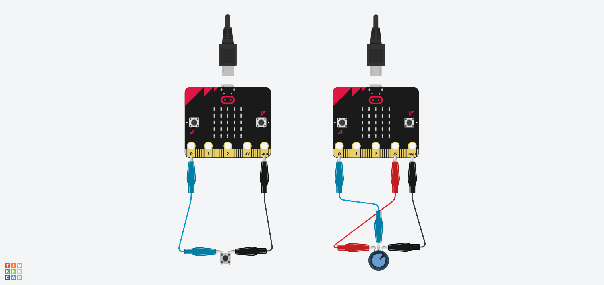
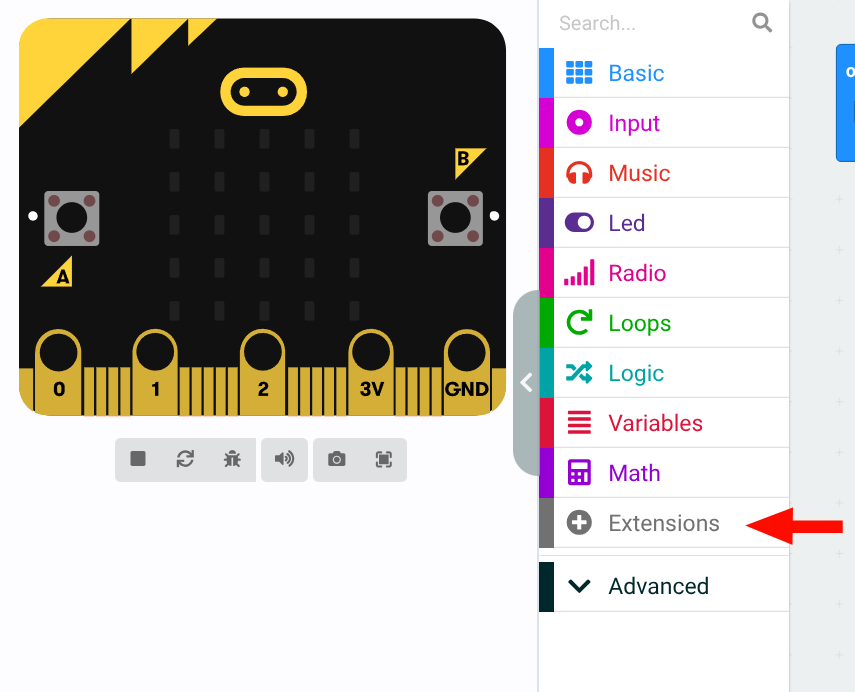
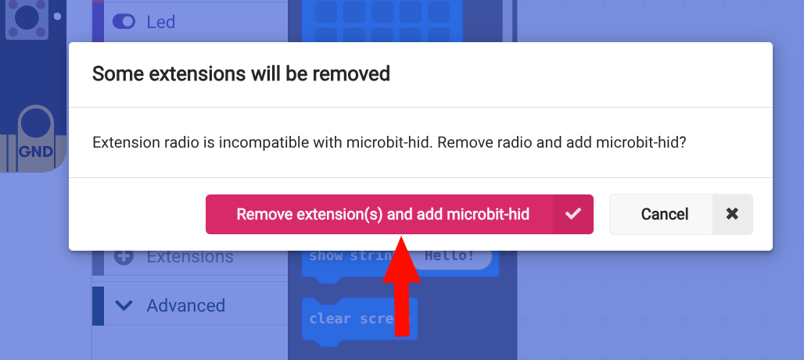
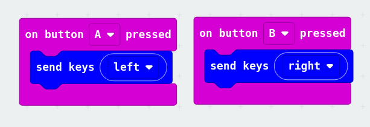
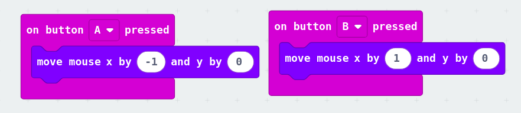
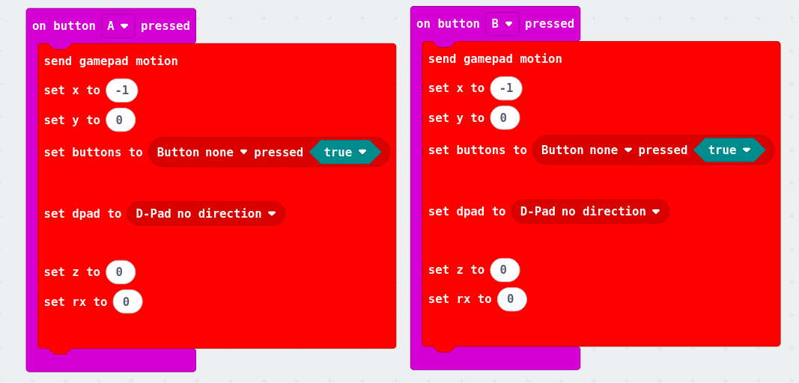

# Week 2 - Maak je eigen Game Controller

In deze week leer je elektrische signalen af te lezen met de Micro:bit en deze te gebruiken als een game controller voor je eigen game!

## Wat ga je leren?

- Het verschil tussen digitale en analoge signalen
- Aansluiten van externe componenten (knoppen en potentiometers)
- De Micro:bit configureren als HID (Human Interface Device)
- Besturen van een game via Bluetooth

---

## [>> Open de Microbit web Editor << ](https://makecode.microbit.org/#editor)

## Signalen - Digitaal vs Analoog

De Micro:bit heeft al veel ingebouwde invoermogelijkheden die je kunt gebruiken voor je controller:

### Ingebouwde sensoren

- **2 Knoppen** (A en B)
- **Accelerometer** - detecteert beweging en kanteling
- **Temperatuursensor** - meet de omgevingstemperatuur
- **Lichtsensor** - meet de omgevingslichtsterkte
- **Kompas (magnetometer)** - detecteert de magnetische noordpool
- **Touch logo** - het gouden logo op de Micro:bit is ook een aanraaksensor

> Meer informatie over alle sensoren vind je op de [ officiële Micro:bit website](https://microbit.org/get-started/features/sensors/).

### Zelf componenten aansluiten

Ook kun je zelf nieuwe componenten aansluiten op de Micro:bit. Hoe je deze uitleest hangt af van welk type signaal het afgeeft:



#### Digitaal signaal

Een **digitaal signaal** kent alleen twee toestanden: aan of uit (1 of 0). Dit is perfect voor knoppen en schakelaars.

- **Voorbeeld**: [Knop (Push Button)](https://www.teachwithict.com/pushbtton.html)
- **Waarden**: `0` (laag/uit) of `1` (hoog/aan)
- **Resolutie**: 1 bit (2 mogelijke waarden)

#### Analoog signaal

Een **analoog signaal** kan een continue reeks waarden hebben, meestal van 0 tot 1023. Dit is ideaal voor precieze controle zoals met een potentiometer.

- **Voorbeeld**: [Potentiometer](https://www.teachwithict.com/potentiometer.html)
- **Waarden**: 0 t/m 1023 (hoe hoger de waarde, hoe meer de potentiometer is opengedraaid)
- **Resolutie**: 10 bits (2¹⁰ = 1024 mogelijke waarden)


---

## Micro:bit als HID

Om de Micro:bit als een game controller te gebruiken, moeten we de **microbit-hid** extensie toevoegen aan MakeCode.

### Stap 1: Open de extensies

Klik op **"Extensions"** in het menu onderaan.



### Stap 2: Voeg de HID extensie toe

Typ de volgende URL in de zoekbalk:

```
https://michaelmcglothlin.github.io/microbit-hid/
```

Klik op de extensie om deze toe te voegen aan je project.

### Stap 3: Verwijder onnodige extensies

Sommige extensies kunnen conflicten veroorzaken. Klik op **"Remove extension"** om ongebruikte extensies te verwijderen.



---

## Programmeer je controller

Nu je de HID extensie hebt toegevoegd, kun je de Micro:bit programmeren om:

- Toetsenbordtoetsen te simuleren
  

- Muis te besturen
  
- Gamepad inputs te sturen
  

---

## Verbinden via Bluetooth

## Extra: voeg meer knoppen toe met de DragonTail
