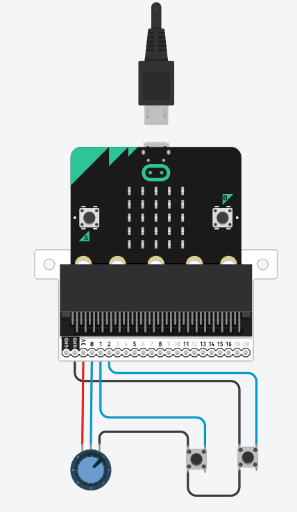

# Week 3 - Controller Design & Game Prototype

In deze week ga je je game controller ontwerpen en een eerste prototype bouwen. Je leert werken met TinkerCAD om je circuit te simuleren en test je ontwerp op een breadboard.

## Wat ga je leren?

- Ontwerpen van een fysieke game controller
- Werken met TinkerCAD voor circuit simulatie
- Een circuit bouwen op een breadboard
- Overzetten van een gesimuleerd circuit naar de fysieke wereld

---

## Controller Design

### Schetsen op papier

Begin met het maken van schetsen van je controller ontwerp:

- **Welke knoppen** heb je nodig voor je game?
- **Waar komen de knoppen** op de controller? (ergonomisch)
- **Heb je een joystick** of draaiknoppen (potentiometers) nodig?
- **Hoe hou je de Micro:bit** vast in je ontwerp?

> Tip: Kijk naar bestaande controllers (PlayStation, Xbox, Nintendo) voor inspiratie, maar bedenk dat jij zelf bepaalt wat handig is!

### Klassikale presentatie

Iedereen presenteert zijn/haar idee kort aan de klas:

- Laat je schetsen zien
- Leg uit **welke game** je gaat maken
- Leg uit **waarom** je voor deze knoppen/indeling hebt gekozen
- Vraag om feedback van je klasgenoten

---

## Game Design

Nu je weet welke inputs je controller nodig heeft, is het tijd om te kijken naar de software kant.

### Verken GameMaker templates

- Neem goed de tijd om een aantal van de **Gamemaker templates** te bekijken
- Kijk welke template het beste past bij jouw controller ontwerp
- Let op het aantal inputs dat een template nodig heeft

### Volg tutorials

- Gebruik de [GameMaker tutorials](https://gamemaker.io/en/tutorials) met filters om het juiste niveau te vinden
- Of bekijk het YouTube kanaal: [GameMaker Tutorials](https://www.youtube.com/@GameMakerEngine/videos)
- Begin met een simpele tutorial die je kunt aanpassen naar je eigen idee

> Doel: Aan het einde van deze week heb je een werkend game prototype dat reageert op toetsenbord input!

---

## Circuit Ontwerp

We gebruiken **TinkerCAD** om het circuit te simuleren voordat we het fysiek bouwen.

### Aan de slag met TinkerCAD

1. Ga naar [TinkerCAD](https://www.tinkercad.com/dashboard) en log in
2. Klik op **Create > Circuits**
3. Start een nieuw project

### Bouw je circuit

Plaats in de simulatie:

- Micro:bit
- Drukknoppen -> Digitale pinnen
- Potentiometers -> Analoge pinnen

### Aansluiten met de DragonTail

De **DragonTail** is een uitbreidingsboard dat het makkelijker maakt om componenten aan te sluiten op de Micro:bit. Je sluit de Micro:bit aan op de DragonTail, en vervolgens kun je componenten aansluiten op de gemarkeerde pinnen.

#### Pinout van de Micro:bit

Let bij het aansluiten van componenten op de volgende pinout:

> **Belangrijk:** Niet alle pinnen zijn gelijk! Sommige pinnen hebben speciale functies en beperkingen.

Kijk ook op [microbit.pinout.xyz](https://microbit.pinout.xyz/) voor een interactief overzicht.

> **Meer analoge pinnen:** P3, P4 en P10 kunnen ook als **analoge input** gebruikt worden, maar alleen als je het LED display uitschakelt met de functie `display.disable()`. Dit geeft je in totaal **6 analoge pinnen** (P0, P1, P2, P3, P4, P10).
>
> Let op: als je het display uitschakelt, werkt ook de **lichtsensor** niet meer (die gebruikt het LED matrix als sensor). Je kunt het display later weer inschakelen met `display.enable()`.
>
> ## De LED matrix heeft weerstanden verbonden aan deze pinnen - houd hier rekening mee bij het ontwerp van je circuit.
>
> **Bron:** Micro:bit Educational Foundation - [Edge Connector & Pinout](https://tech.microbit.org/hardware/edgeconnector/#pins-and-signals)

---

## Van Simulatie naar Realiteit

Test je circuit op het breadboard. Controleer of alle componenten correct aangesloten zijn en of de signalen correct werken.
