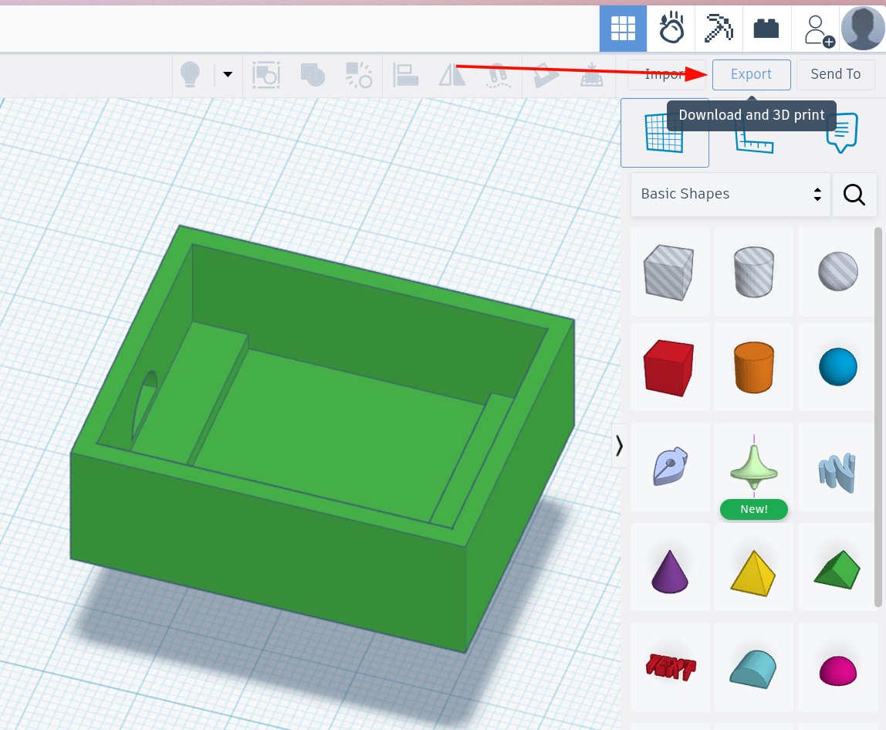
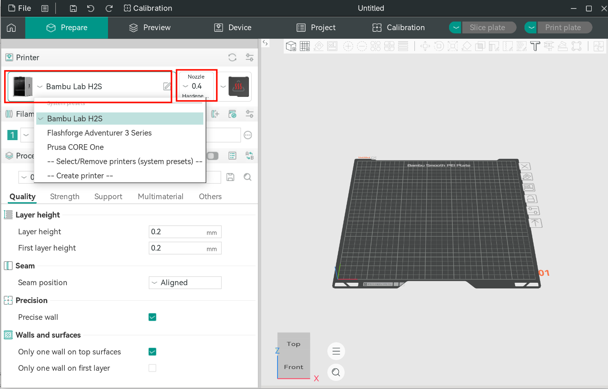
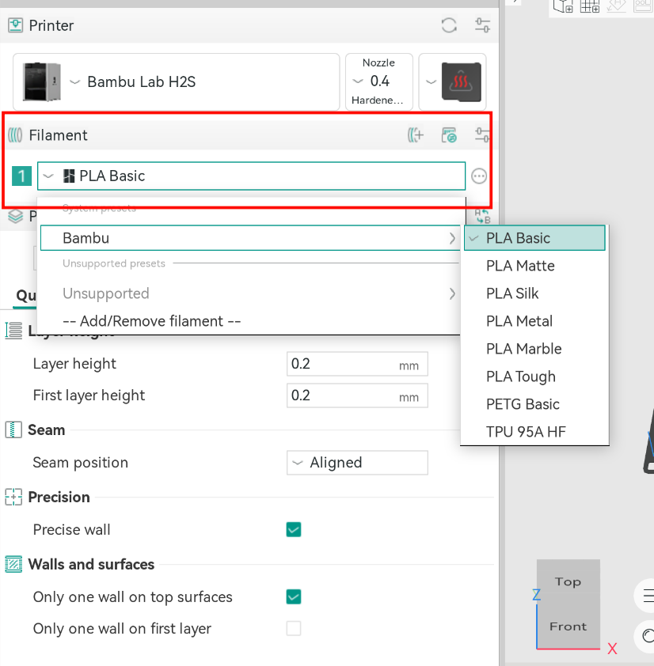
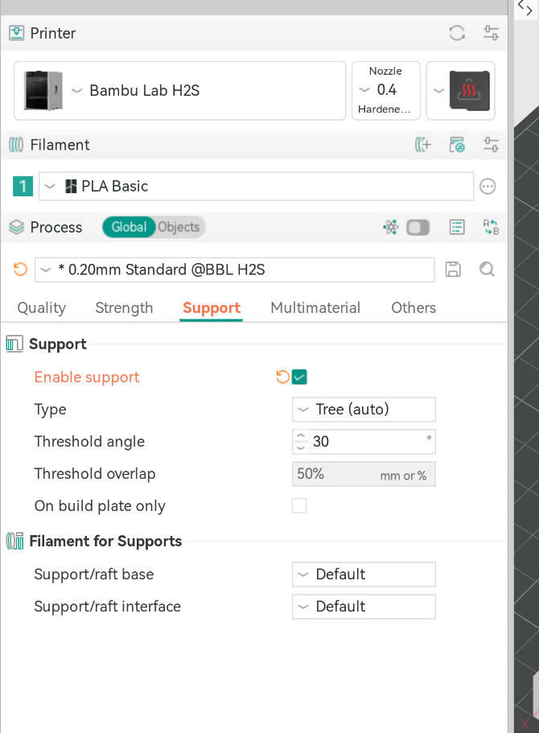
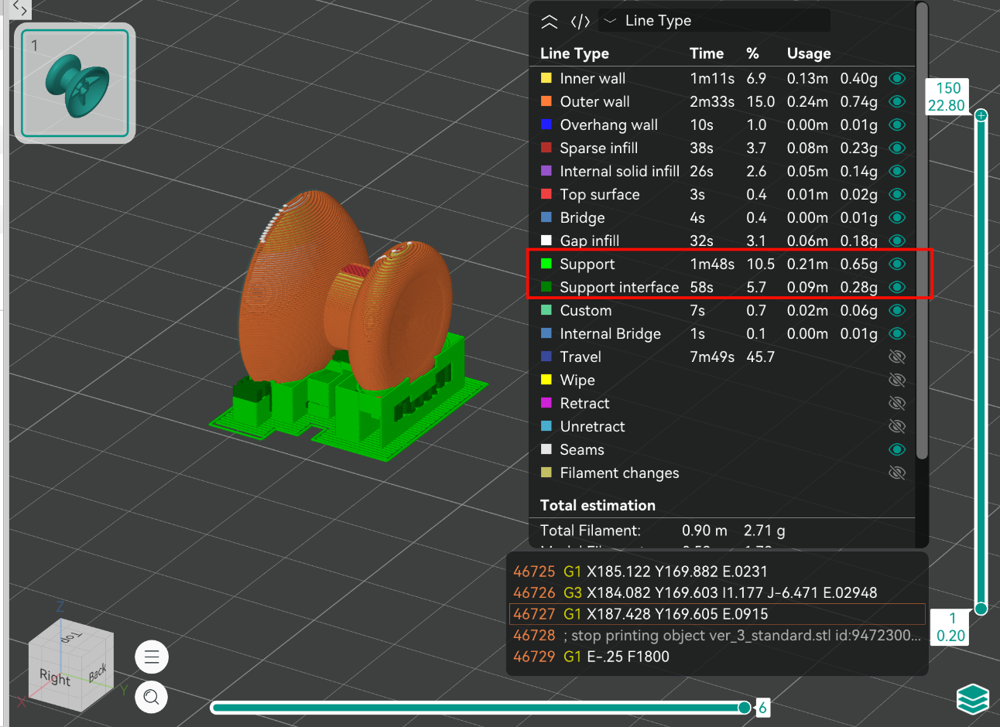
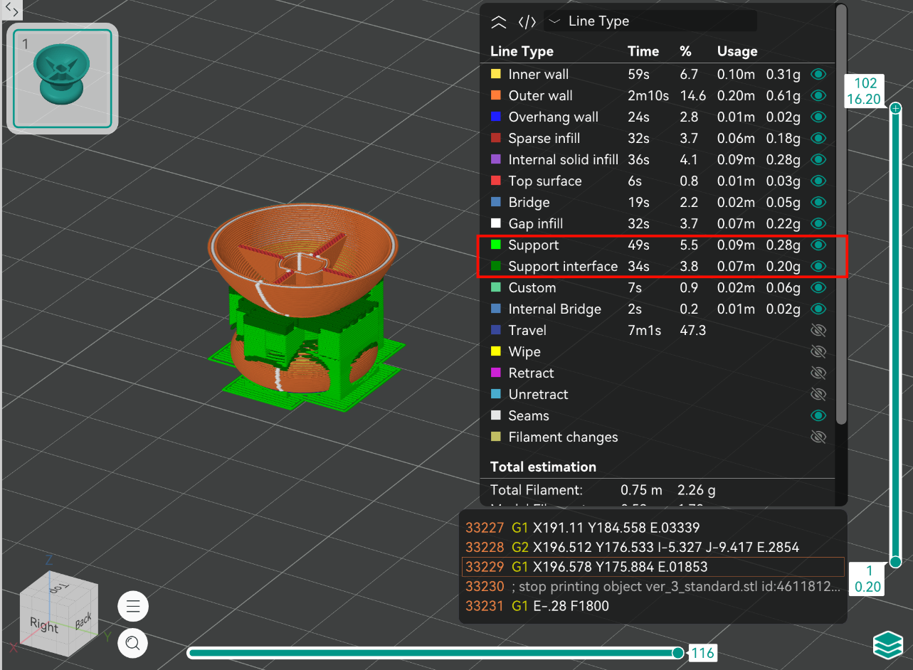

# Week 5 - Je controller 3D printen

In deze week maak je de stap van een digitaal ontwerp naar een echt, geprint onderdeel. Je exporteert je model uit TinkerCAD, bereidt het voor in een slicer en controleert of het klaar is om te printen.

## Wat ga je leren?

- Je 3D model exporteren als `.stl`
- Werken met een slicer om een print voor te bereiden
- De juiste printer- en materiaalinstellingen kiezen
- Controleren of je model goed printbaar is

---

## Exporteer je model

Als je ontwerp in TinkerCAD klaar is, exporteer je het als een **STL bestand**.

1. Open je ontwerp in TinkerCAD
2. Klik op **Export**
3. Kies het bestandstype **.STL**

---

## Kies de juiste slicer

Na het exporteren moet je je 3D model eerst **slicen**. Dat betekent dat software je model opdeelt in dunne laagjes en omzet naar instructies voor de printer.

Voor dit voorbeeld gebruiken we **Orca Slicer**. De stappen kunnen een klein beetje verschillen bij andere slicers of printers.

### Voor de printers van Citylab

- **Prusa** -> PrusaSlicer of Orca Slicer
- **Bambu Lab** -> Bambu Studio
- **Flashforge** -> Orca Flashforge

Gebruik bij voorkeur de laptops van Citylab. Daarop staan de slicers al geïnstalleerd met de juiste printerprofielen.

---

## Nieuw project starten

Open je slicer en maak een nieuw project aan:

1. Klik op **Create New Project**
2. Kies de juiste printer
3. Importeer je `.stl` bestand
4. Controleer of je model netjes op het printbed staat

---

## Prepare Tab

In de **Prepare** tab stel je de belangrijkste printinstellingen in.

### Printer instellen

Kies het profiel van de printer die je gaat gebruiken. Dit is belangrijk omdat elke printer een ander printbed, nozzle-formaat en standaardinstellingen kan hebben.

- Selecteer het juiste printermodel
- Laat de nozzle diameter en het printbed formaat staan op de standaardinstellingen.

### Materiaal instellen

#### Plastic

Kies een **PLA profiel** dat past bij het filament dat je gebruikt.

#### Laagdikte

De **laagdikte** bepaalt hoeveel detail je print krijgt en hoe lang de print duurt.

- **0.20 mm** is een goede standaardinstelling
- **0.12 mm** geeft meer detail, maar duurt langer
- **0.28 mm** print sneller, maar ziet er grover uit

Voor de meeste controller onderdelen is **0.20 mm** prima.

### Infill

De **infill** bepaalt hoe vol de binnenkant van je print is.

- **10% - 15%** is vaak genoeg voor decoratieve of lichte onderdelen
- **20% - 30%** is beter voor onderdelen die steviger moeten zijn

Gebruik liever niet meteen een heel hoge infill: dat kost veel tijd en materiaal, en is vaak niet nodig.

### Support materiaal

Sommige vormen kunnen niet goed in de lucht geprint worden. Dan heb je **supports** nodig.

Gebruik support alleen als het echt nodig is:

- bij grote overhangende delen
- bij gaten of vormen die anders zouden doorzakken
- bij onderdelen die niet slim gedraaid kunnen worden

> Minder support betekent meestal een mooiere print en minder nabewerking.

Zet support aan in Orca slicer:

Kijk voor meer informatie over support op de [Bambu Lab wiki](https://wiki.bambulab.com/en/filament-acc/filament/print-quality/overhang).

---

## Tips voor een goede print

### Print oriëntatie

De richting waarin je model op het printbed ligt heeft veel invloed op:

- de stevigheid van het onderdeel
- de zichtbare laaglijnen
- hoeveel support nodig is
- hoe lang de print duurt

> Door je model te draaien kun je soms support verminderen of zelfs helemaal vermijden. Dit scheelt materiaal, printtijd en nabewerking.

### Toleranties

3D printers zijn niet perfect nauwkeurig. Houd daarom ruimte tussen onderdelen die in elkaar moeten passen.

Denk aan:

- minimaal **0.2 mm tot 0.4 mm speling** tussen bewegende of passende onderdelen
- gaten die in de praktijk vaak iets kleiner uitvallen dan in je ontwerp
- knoppen en uitsparingen die wat extra ruimte nodig hebben

> Ontwerp je iets dat precies "strak" moet passen? Maak dan eerst een kleine testprint.

---

## Slice je model

Als je instellingen goed staan, klik dan op **Slice Plate**.

De slicer berekent dan:

- hoe de lagen worden opgebouwd
- hoeveel materiaal nodig is
- hoe lang de print ongeveer duurt

Controleer deze informatie voordat je verder gaat.

---

## Preview Tab

In de **Preview** tab kun je precies zien hoe de printer je model gaat opbouwen.

Controleer hier:

- of alle lagen logisch opgebouwd worden
- of supports op de juiste plek zitten
- of er geen losse of zwevende onderdelen zijn
- of de printtijd en hoeveelheid materiaal realistisch zijn

Dit is het moment om fouten nog te ontdekken voordat je echt gaat printen.

> ### ⚠️ Voordat je gaat printen ⚠️
>
> #### Laat je printinstelling controleren door een van de medewerkers van Citylab!
