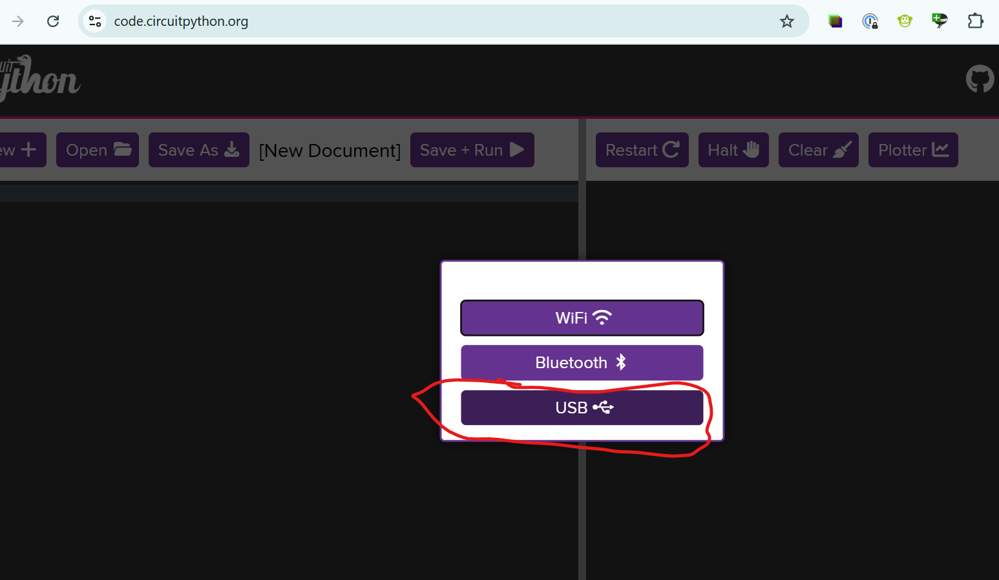
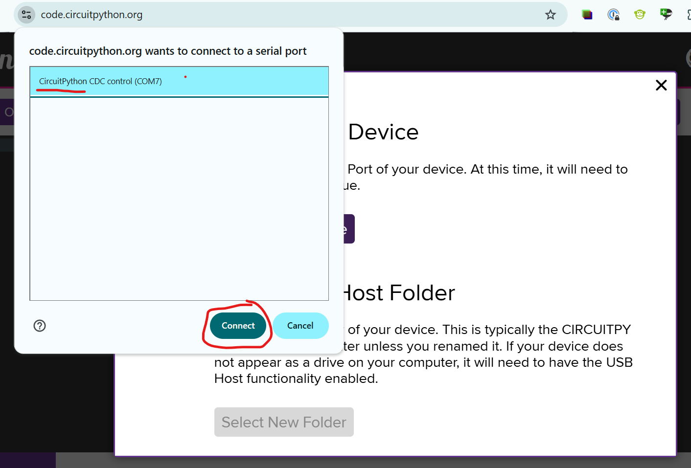
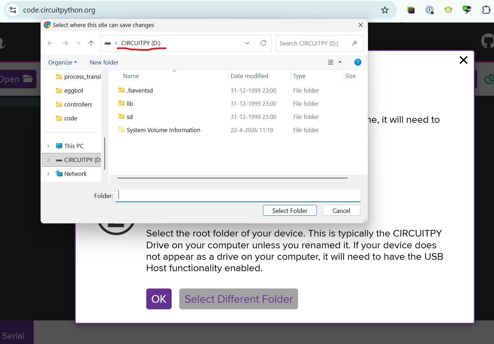

# Week 6: RP2040 flashen met CircuitPython

Download de CircuitPython-firmware voor de RP2040 Zero:

https://circuitpython.org/board/waveshare_rp2040_zero/

## 1. Firmware flashen

Houd de `BOOT`-knop ingedrukt en sluit de microcontroller via USB aan op je computer.
Er verschijnt een USB-schijf met een naam zoals `RPI-RP2`.

Kopieer het gedownloade firmwarebestand naar deze schijf. De microcontroller start daarna automatisch opnieuw op.
Na het herstarten verschijnt een nieuwe USB-schijf met de naam `CIRCUITPY`.

## 2. Een voorbeeld uploaden

Kies een van deze voorbeelden:

- [./Week6/code_voorbeelden/1_GAMEPAD](./code_voorbeelden/1_GAMEPAD)
- [./Week6/code_voorbeelden/2_KEYBOARD](./code_voorbeelden/2_KEYBOARD)

Sleep de inhoud van de gekozen map naar de microcontroller. Overschrijf bestaande bestanden als daarom gevraagd wordt.

## 3. Code aanpassen

Open https://code.circuitpython.org/ in Chrome of een andere Chromium-browser. Firefox en Safari ondersteunen dit niet, omdat je WebUSB nodig hebt.

Verbind de microcontroller met de computer via USB.

Selecteer het CircuitPython-apparaat in de dropdown.

Selecteer daarna je CircuitPython-apparaat als host folder en open `code.py` om de code aan te passen.

4. Test je gamepad
   Op deze site kun je makkelijk je gamepad testen: https://hardwaretester.com/gamepad
